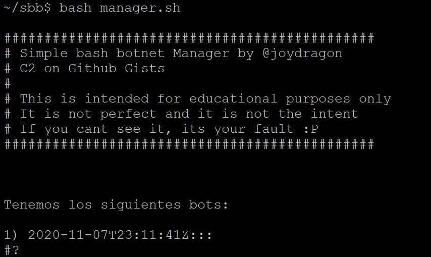

# Simple-Bash-Botnet

This is a project to create a simple botnet in bash that can interact with Github Gists.

This is intended as an educational project that will be explained in an article in finsin.cl (soon)

To make it work, you'll need a Github personal token that can create and manipulate Gists (https://docs.github.com/en/free-pro-team@latest/github/authenticating-to-github/creating-a-personal-access-token)

It's recommended to use a new account for this so you don't polute your communication channel with your own gists.

# Using the manager

For the first time, you'll need to execute the manager.sh file to setup the private and public keys, then add the text of the public key to the bot file (sbb.sh).

After that you'll just need for some bot to connect so you can list them with the manager like this:

